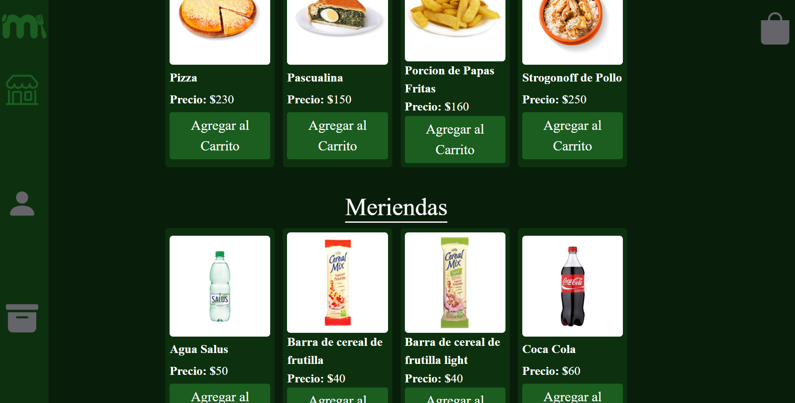

# Inicialización
- [ Descargar node ]( https://nodejs.org/)
- Descargar Live Server
- "npm install" en la terminal para descargar las dependencias que utilizo en el proyecto
- "npm start" en la terminal
- Dirigirse a http://127.0.0.1:8080/src/interface/

# Introducción
Este proyecto nació de un trabajo obligatorio para la facultad para la materia Fundamentos de Ingeniería de Software donde aplicabamos los conocimientos aplicados al proceso de desarrollo de software. Se puede ver la documentacion de la investigación en la carpeta docs. La entrega del trabajo no fue ideal por lo que una vez terminado seguí trabajando en el por mi cuenta. 

El proyecto trataba de hacer una web con un solo archivo html por la cual el usuario pueda realizar la compra del menú diario de sus hijos. En base a una entrevista a un usuario de una aplicación similar a la que ibamos a desarrollar llegamos a la conclusión que esta aplicación debia incluir mas funcionalidades que solo poder comprar el menu del día, como comprar menues alternativos y meriendas para los comensales. 

# Screenshots

### Pagina de recepción

### Sección Usuarios

### Sección Resumen de Órdenes

### Sección Menú

### Carrito de Compras

# Tecnologías utilizadas 
- Nodemon
- Node.js
- Html
- Css
- Bootstrap
- Jest

# Actualmente
En el momento me encuentro aprendiendo acerca de node.js para poder montar el servidor sin live server y poder conectarlo con una base de datos para hacer una implementación mas realista.

